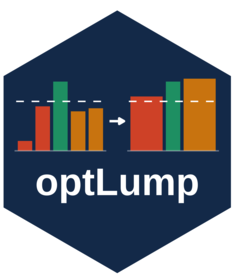

<!-- README.md is generated from README.Rmd. Please edit that file -->

```{r, include = FALSE}
knitr::opts_chunk$set(
  collapse = TRUE,
  comment = "#>",
  fig.path = "man/figures/README-",
  out.width = "100%"
)
```

# optLump <a href="https://daankoning.github.io/optLump/"></a>

<!-- badges: start -->
[](https://github.com/daankoning/optLump/releases/latest)
[](https://github.com/daankoning/optLump/actions/workflows/R-CMD-check.yaml)
[](https://daankoning.github.io/optLump/)
<!-- badges: end -->

The `optLump` package provides functions to optimally lump together factor levels in a data frame.
This is useful for reducing the number of levels in a factor variable, which can improve the fit and interpretability of a model.

## Installation

The package can be obtained from [https://github.com/daankoning/optLump/releases/latest](https://github.com/daankoning/optLump/releases/latest).
Alternatively, install with
```bash
# install.packages("pak")
pak::pkg_install("daankoning/optLump")
```

## Usage

For usage instructions, see `vignette("optLump")`.

